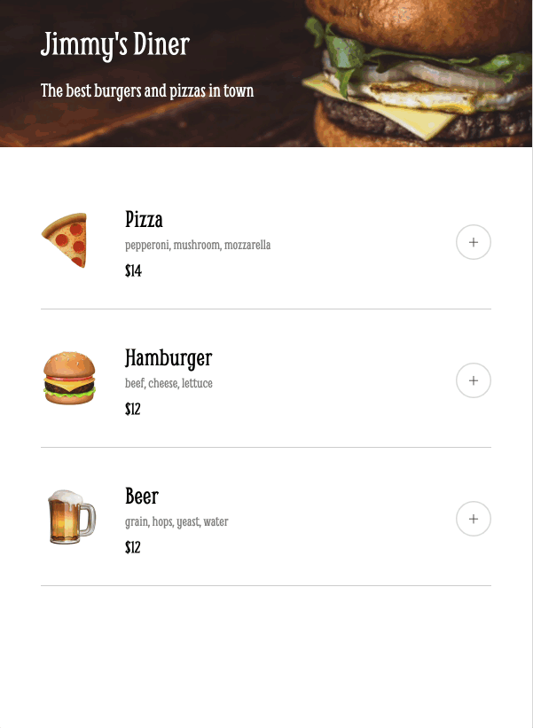

# Restaurant Menu

Prototype of a mobile restaurant menu app, made for the Scrimba front-end developer course. Built with HTML, CSS, and JavaScript.

## Features

- Load and render menu objects dynamically
- Add / remove menu items from order
- Payment capture modal

## Technologies Used

- HTML
- CSS
- JavaScript

## How It Works

`menu.js` holds the menu objects. The app renders the menu from those objects. As items are added to the order, we keep track in `orders[]` and dynamically render that as well. The payment confirmation modal only checks if data is entered and does no other validation.

## Usage

1. Open `index.html` in a web browser
2. Add & remove items from the menu and place a mock order

## Files

- `index.html`: The main HTML structure
- `styles.css`: Styles for the menu application
- `main.js`: JavaScript for dynamically rendering the menu